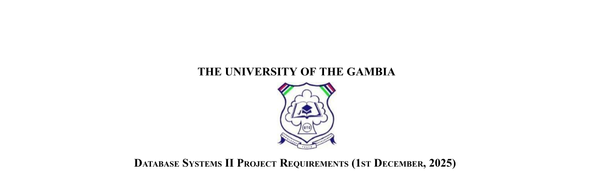
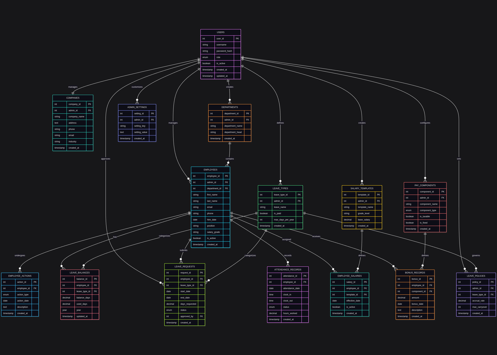
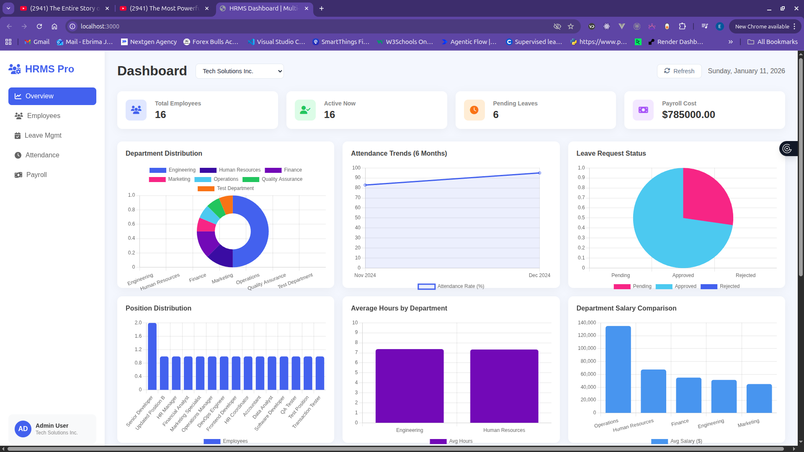
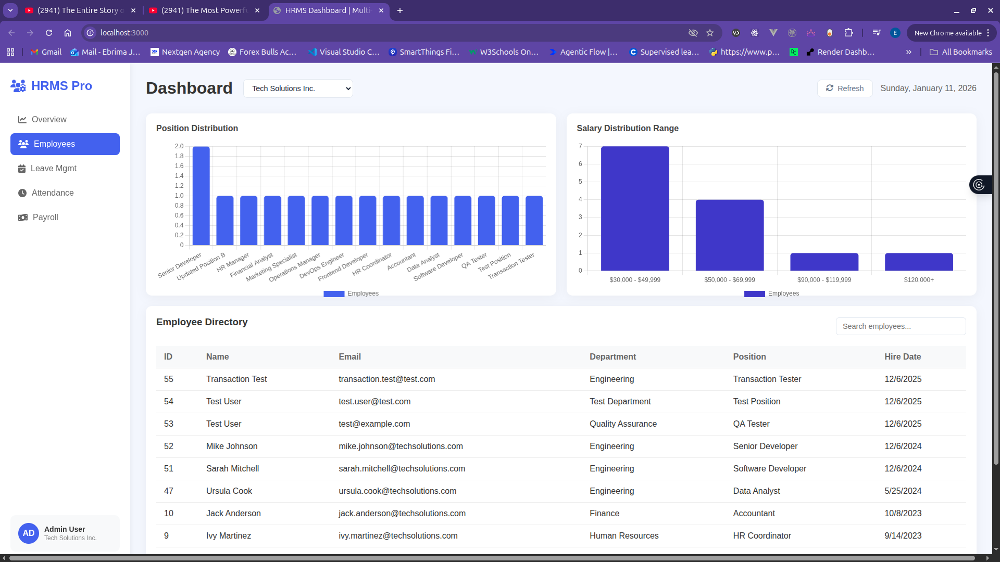
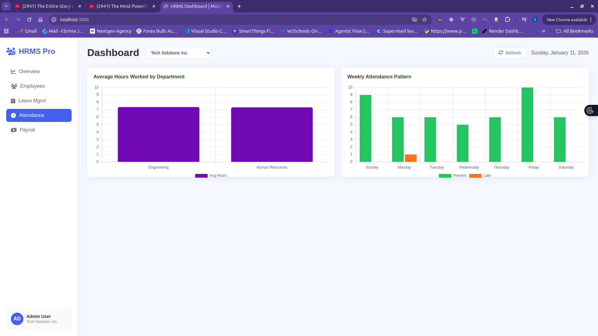
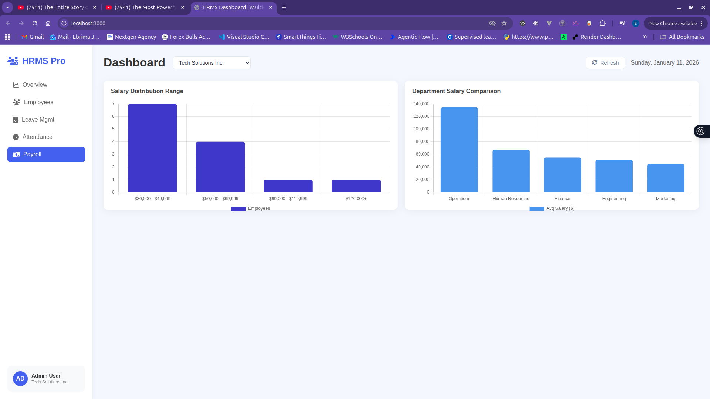
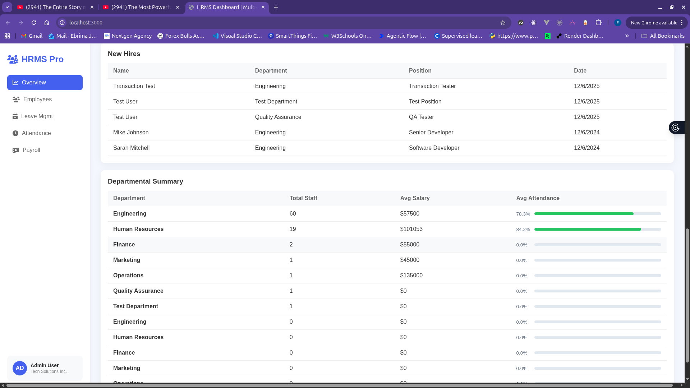

# **Project Title:** Multi-Tenant Human Resources Management System (HRMS)  
**Course Code:** Database Systems II  
**Submission Date:** January 11, 2026  
**Repository:** [https://github.com/C-Jalloh/HRMS-DB2](https://github.com/C-Jalloh/HRMS-DB2)

**Team Members:**
1. Mamadou Alieu Jallow - 22316058
2. Ousainou Sanyang - 22316027
3. Ebrima S Jallow - 22213296

---

# Introduction
### Overview
The Multi-Tenant Human Resources Management System (HRMS) is a robust database-driven application designed to help multiple organizations manage their workforce in a secure and isolated environment. Developed for the Database Systems II course at The University of The Gambia, the system addresses the complexities of modern HR management including recruitment, payroll, leave tracking, and attendance monitoring.

### Objectives
*   To design a highly normalized (3NF) relational database schema consisting of 15+ interconnected tables.
*   To implement strict data isolation between multiple tenants (companies) using session-based filtering.
*   To automate core HR workflows such as leave balance calculations, attendance trends, and payroll processing.
*   To provide real-time analytical insights via a query-driven dashboard.

---

# Requirements
### Scope
The project covers the complete lifecycle of employee management, starting from onboarding to termination. It encompasses payroll structures, leave policies, and daily attendance tracking for multiple distinct companies sharing the same database infrastructure.

### Features
*   **Multi-Tenancy:** Automated data isolation ensuring administrators only see records belonging to their specific organization.
*   **Employee Lifecycle Management:** Comprehensive tracking of employee history, positions, and promotions.
*   **Advanced Leave System:** Intelligent leave balance tracking with automated approval/rejection logic.
*   **Payroll & Compensation:** Flexible salary templates and component-based pay structures.
*   **Attendance & KPI Tracking:** Real-time monitoring of staff presence and performance metrics.

---

# ER Diagram
### Diagram


### Explanation
The Entity Relationship Diagram (ERD) illustrates a complex architecture centered around the `users` and `companies` entities. 
*   **Core Entities:** `users`, `admin_profiles`, and `companies` manage authentication and tenant identification.
*   **Relational Backbone:** Every record in the `employees`, `departments`, and `attendance_records` tables is linked back to a specific `admin_id` (Tenant ID), enforcing a strict hierarchical data ownership model.
*   **Subsystems:** Separate but interconnected clusters manage **Payroll** (`salary_templates`, `employee_salaries`), **Leave** (`leave_requests`, `leave_balances`), and **Attendance**.

---

# Database Design Description
### Tables and Attributes
The schema utilizes 15 tables designed according to 3rd Normal Form (3NF) principles:
*   **employees:** Stores core metadata (names, emails, positions) with a `salary_grade` attribute for classification.
*   **leave_balances:** Tracks annual entitlements using `balance_days` and `used_days` attributes.
*   **salary_templates:** Defines base pay and structure for different job tiers.
*   **attendance_records:** Logs daily logs with `clock_in`, `clock_out`, and `status`.

### Constraints and Relationships
*   **Foreign Keys:** Rigid referential integrity is enforced via InnoDB. For instance, `employees` are linked to `departments` via a `department_id` with `ON DELETE SET NULL`.
*   **Unique Constraints:** Enforced on emails and usernames to prevent data duplication.
*   **Relationships:** A one-to-many relationship exists between `companies` and `employees`, while `employees` have a many-to-one relationship with `departments`.

---

# Query Section
### CRUD Operations
The system supports atomic operations for all entities. 
*   **Create (Onboarding):** Uses an ACID transaction to simultaneously insert records into `employees`, `employee_actions`, and `leave_balances`.
*   **Update (Salary Adjustment):** Implements a history-preserving update strategy where old salary records are deactivated before new ones are inserted.

### SELECT Queries
The application utilizes complex JOINs and aggregations to drive the frontend.
```sql
-- Comprehensive HR Dashboard KPIs using UNION ALL
SELECT 'Total Employees' as metric_name, COUNT(*) as metric_value 
FROM employees WHERE admin_id = @current_admin_id AND is_active = 1
UNION ALL
SELECT 'Awaiting Leave Approval', COUNT(*) 
FROM leave_requests WHERE status = 'pending';
```
*The output of these queries is displayed in real-time on the administrative dashboard screenshots in Section 8.*

---

# Indexing
### Applied Indexing
Targeted indexing was applied to high-traffic columns to maintain performance.
*   **idx_employees_admin_hire:** A composite index on `(admin_id, hire_date)`.
*   **idx_attendance_employee_date:** An index on `(employee_id, attendance_date)`.

### Impact Analysis
*   **Query Speed:** By using `idx_employees_admin_hire`, the time taken to filter employees by tenant plummeted from $O(N)$ linear scans to $O(\log N)$ b-tree lookups.
*   **Efficiency:** This ensures that dashboard metrics remain responsive even as the database grows to thousands of records.

---

# Dashboard
### Screenshots






### Explanation of Visuals
The dashboard provides a meaningful, real-time representation of the MySQL database content through four key components:

*   **Key Performance Indicators (KPIs):** Instant summaries of total headcount, active status counts, pending leave requests, and total monthly payroll liability ($ USD).
*   **Multi-Type Charting:** 
    *   *Doughnut Charts:* Organizational staff distribution by department.
    *   *Line Charts:* 6-month historical attendance trends showing organizational consistency.
    *   *Bar Charts:* Salary range distributions and departmental cost comparisons.
    *   *Pie Charts:* Leave request status breakdowns (Approved vs. Pending vs. Rejected).
*   **Summary Tables:**
    *   *New Hires:* Chronological view of the most recent organizational additions.
    *   *Departmental Summary:* A high-level aggregation showing staff volume, average salary per sector, and a visual progress bar for departmental attendance rates.
*   **Data Integration:** Every visual element is driven by complex SQL queries using `GROUP BY`, `AVG`, `SUM`, and `UNION ALL` across multiple tables, ensuring the dashboard reflects the exact state of the HRMS environment.

---

# Team Contributions
### 6.1 Mamadou Alieu Jallow (22316058)
*   **Database Foundation:** Responsible for initial schema prototyping and entity relationship mapping for the core tables (users, companies, departments).
*   **Data Integrity & Population:** Managed the generation and sanitization of the 500+ sample records to ensure referential integrity was maintained across all 15 tables.
*   **SQL Operations:** Authored standard CRUD scripts for organizational entities and implemented initial JOIN queries for basic record retrieval.

### 6.2 Ousainou Sanyang (22316027)
*   **Reporting & Analytics:** Developed complex aggregate queries for department-wise salary breakdowns and monthly attendance summaries used in the dashboard.
*   **Database Security:** Implemented Multi-Tenant security views and session-based filtering logic to enforce strict data isolation between administrators.
*   **Validation Testing:** Conducted comprehensive SQL testing scripts to verify constraints and trigger-like consistency across the leave management subsystem.

### 6.3 Ebrima S Jallow (22213296) - Project Lead & Database Architect
*   **Lead Database Architect:** Directed the design of the entire 15-table relational schema, ensuring strict adherence to 3rd Normal Form (3NF) and database scalability.
*   **Performance Engineering:** Conceptualized and implemented the composite indexing strategy (idx_employees_admin_hire, idx_attendance_employee_date), including the detailed performance impact analysis for the final report.
*   **Atomic Transaction Logic:** Architected the project's most complex database logic, including multi-table ACID transactions for Employee Onboarding and automated Leave Balance validation/deduction workflows.
*   **Advanced Query Optimization:** Authored the dashboard's high-performance KPI engine using advanced UNION ALL structures and nested subqueries for employee tenure analysis.
*   **Visualization Architecture:** Bridge the gap between the database engine and the frontend by designing the SQL result-set structures required for Chart.js visualizations.
*   **Technical Lead & Synthesis:** Managed the consolidation of the Master SQL submission script and served as the lead editor for the final technical report.

---

# Conclusion
### What We Learned
We mastered the implementation of ACID-compliant transactions and the complexities of designing a multi-tenant schema that remains performant under load.

### Challenges Faced
Maintaining referential integrity during bulk data population and managing transaction deadlocks between attendance and payroll updates were significant technical hurdles.

### Recommendations
For future iterations, we recommend migrating complex business logic into **MySQL Stored Procedures** and implementing a automated horizontal scaling strategy.
