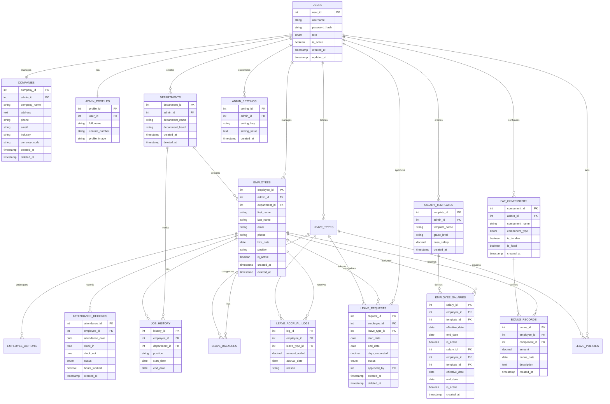

# Multi-Tenant Human Resources Management System (HRMS) - Project Documentation

## 1. Project Overview
This project is a comprehensive **Multi-Tenant Human Resources Management System (HRMS)** developed for the Database Systems II course. It is designed to manage HR operations for multiple organizations (tenants) within a single database instance, ensuring strict data isolation between them.

### Core Objectives:
- **Multi-Tenancy**: Support multiple companies with isolated data.
- **Employee Lifecycle**: Manage onboarding, promotions, transfers, and terminations.
- **Leave Management**: Track leave types, policies, balances, and requests.
- **Time & Attendance**: Monitor daily clock-in/out and attendance status.
- **Payroll Management**: Define salary structures, components, and bonuses.
- **Data Visualization**: Provide a dashboard for real-time HR metrics.

---

## 2. System Architecture
The system follows a classic client-server architecture with a focus on database integrity and multi-tenant isolation.

- **Database**: MySQL 8.0+ (InnoDB engine) with 15 interconnected tables.
- **Backend**: Node.js (Express) API for serving dashboard data.
- **Frontend**: HTML5, CSS3, and JavaScript (Vanilla) dashboard using Chart.js for visualization.
- **Multi-Tenant Isolation**: Achieved via `admin_id` foreign keys in all tenant-specific tables, ensuring that admins only see data belonging to their organization.

---

## 3. Database Design
The database is 3NF compliant and consists of 15 tables categorized into several modules.

### 3.1 Entity-Relationship Diagram (ERD)
The following diagram illustrates the relationships between the 15 tables in the HRMS.

### 3.2 Detailed Table Descriptions

| Table Name | Description | Key Columns |
|:---|:---|:---|
| **`users`** | System-wide accounts for Superadmins and Tenant Admins. | `user_id`, `username`, `role` |
| **`companies`** | Organization profiles linked to a specific Admin. | `company_id`, `admin_id`, `company_name` |
| **`departments`** | Organizational units within a company. | `department_id`, `admin_id`, `department_name` |
| **`employees`** | Master data for all employees across all tenants. | `employee_id`, `admin_id`, `department_id`, `email` |
| **`employee_actions`** | Audit trail for employee lifecycle events (Hire, Promotion, etc.). | `action_id`, `employee_id`, `action_type` |
| **`leave_types`** | Categories of leave (Annual, Sick, etc.) defined by Admins. | `leave_type_id`, `admin_id`, `leave_name` |
| **`leave_policies`** | Rules for leave accrual and carryover per leave type. | `policy_id`, `leave_type_id`, `accrual_rate` |
| **`leave_balances`** | Current leave entitlements for each employee per year. | `balance_id`, `employee_id`, `leave_type_id`, `year` |
| **`leave_requests`** | Employee applications for time off and their approval status. | `request_id`, `employee_id`, `status`, `approved_by` |
| **`attendance_records`** | Daily time tracking logs (clock-in/out) and status. | `attendance_id`, `employee_id`, `attendance_date` |
| **`pay_components`** | Definitions of earnings and deductions (Bonus, Tax, etc.). | `component_id`, `admin_id`, `component_name` |
| **`salary_templates`** | Standardized salary structures based on grade levels. | `template_id`, `admin_id`, `base_salary` |
| **`employee_salaries`** | Mapping of employees to specific salary templates. | `salary_id`, `employee_id`, `template_id` |
| **`bonus_records`** | Individual bonus or deduction payments made to employees. | `bonus_id`, `employee_id`, `component_id`, `amount` |
| **`admin_settings`** | Tenant-specific configuration and preferences. | `setting_id`, `admin_id`, `setting_key` |

---

## 4. Advanced SQL Features

### 4.1 ACID Compliant Transactions
The system demonstrates robust transaction management to ensure data integrity during complex operations.

1.  **Employee Onboarding**: A multi-step transaction that:
    - Inserts a new employee record.
    - Logs the 'hire' action in `employee_actions`.
    - Assigns a salary template in `employee_salaries`.
    - Initializes leave balances for the current year.
    - Creates an initial attendance record.
    - *Uses `COMMIT` on success and `ROLLBACK` on any failure (e.g., invalid salary template).*

2.  **Leave Approval Process**:
    - Checks current leave balance.
    - Updates the `leave_requests` status to 'approved'.
    - Deducts the requested days from `leave_balances`.
    - *Ensures that balances never drop below zero through atomic updates.*

### 4.2 Performance Optimization (Indexing)
To handle large datasets efficiently, the following indexes are implemented:
- **`idx_employees_admin_hire`**: Speeds up tenant-specific employee reports.
- **`idx_attendance_employee_date`**: Optimizes attendance history lookups.
- **`idx_leave_balances_employee_year`**: Accelerates year-end leave processing.
- **`idx_leave_requests_employee_status`**: Improves dashboard performance for pending requests.

### 4.3 Data Integrity & Constraints
- **Foreign Keys**: All relationships use `ON UPDATE CASCADE` and `ON DELETE RESTRICT/CASCADE` to maintain referential integrity.
- **Check Constraints**:
    - `balance_days >= 0` in `leave_balances`.
    - `hours_worked` between 0 and 24 in `attendance_records`.
    - `start_date <= end_date` in `leave_requests`.
- **Unique Constraints**: Prevents duplicate entries for usernames, company-admin links, and yearly leave balances.

---

## 5. Key Features & Functionality

### 5.1 Multi-Tenant Data Isolation
Every organization is managed by an `admin`. All data related to employees, departments, leaves, and payroll is linked to an `admin_id`. Queries are filtered by this ID to ensure data privacy.

### 5.2 Leave Management System
A robust system that handles:
- Different leave categories (Annual, Sick, Maternity, etc.).
- Accrual rates and carryover policies.
- Real-time balance tracking.
- Approval workflow for leave requests.

### 5.3 Payroll & Compensation
- Flexible salary templates based on grade levels.
- Support for both earnings and deductions.
- Automated salary assignments for employees.

---

## 6. Dashboard & Visualization
The project includes a functional dashboard located in the `dashboard/` directory.

- **KPIs**: Displays total employees, active employees, pending leaves, and total payroll cost.
- **Charts**:
    - Department Distribution (Pie/Bar Chart).
    - Attendance Trends (Line Chart).
    - Leave Status Overview.
- **Technology**: Uses `mysql2` for database connectivity and `express` for the API.

---

## 7. Project Structure & Files

### Root Directory
- [README.md](README.md): High-level project overview and quick start guide.
- [HRMS_Implementation_Plan.md](HRMS_Implementation_Plan.md): Detailed planning and requirements document.
- [Project_Overview.md](Project_Overview.md): This comprehensive documentation.

### Database Schemas (`database_schemas/`)
- [hrms_schema.sql](database_schemas/hrms_schema.sql): The complete DDL script for creating the database.
- [hrms_sample_data.sql](database_schemas/hrms_sample_data.sql): DML script with 10+ sample records per table.
- [hrms_crud_operations.sql](database_schemas/hrms_crud_operations.sql): Standard SQL operations for all modules.
- [hrms_required_queries.sql](database_schemas/hrms_required_queries.sql): Advanced SQL queries (JOINs, Aggregates, Subqueries).
- [hrms_transactions.sql](database_schemas/hrms_transactions.sql): Demonstrations of ACID compliance (COMMIT/ROLLBACK).
- [hrms_dashboard_data.sql](database_schemas/hrms_dashboard_data.sql): Specialized queries for data visualization.
- [hrms_validation_tests.sql](database_schemas/hrms_validation_tests.sql): Integrity and constraint validation scripts.
- [hrms_erd_design.md](database_schemas/hrms_erd_design.md): Documentation of the Entity-Relationship Diagram.

### Dashboard (`dashboard/`)
- [server.js](dashboard/server.js): Node.js Express server and API endpoints.
- [index.html](dashboard/index.html): Main dashboard interface.
- [script.js](dashboard/script.js): Frontend logic and chart rendering.
- [style.css](dashboard/style.css): Dashboard styling.
- [db_config.php](dashboard/db_config.php): Alternative PHP configuration for database access.

### Memory Bank (`memory-bank/`)
- Contains internal project state, architectural decisions, and progress tracking files used by the development environment.

---

## 8. Setup & Installation

1. **Database Setup**:
   - Execute `database_schemas/hrms_schema.sql` in MySQL.
   - Execute `database_schemas/hrms_sample_data.sql` to populate the system.

2. **Dashboard Setup**:
   - Navigate to the `dashboard/` folder.
   - Run `npm install` to install dependencies.
   - Update database credentials in `server.js`.
   - Run `node server.js` to start the API.
   - Open `index.html` in a web browser.
